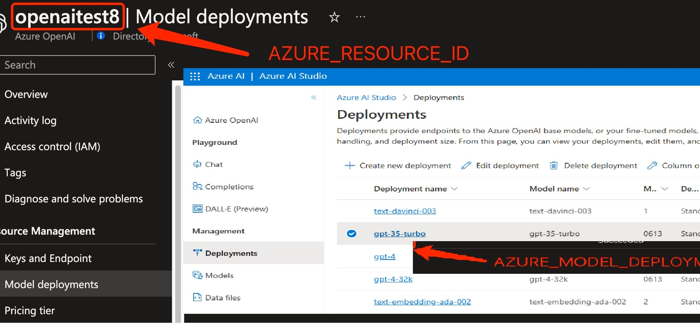

# Azure OpenAI Proxy

[English](./README.md) | 简体中文

Azure OpenAI Proxy 是一个 OpenAI API 的代理工具，能将 OpenAI API 请求转为 Azure OpenAI API 请求，从而让只支持 OpenAI 的应用程序无缝使用 Azure OpenAI。

## 使用条件

你需要有一个 Azure OpenAI 账户才能使用 Azure OpenAI Proxy。

## Azure 部署

[](https://portal.azure.com/#create/Microsoft.Template/uri/https%3A%2F%2Fraw.githubusercontent.com%2Fscalaone%2Fazure-openai-proxy%2Fmain%2Fdeploy%2Fazure-deploy.json)

请注意：

- 选择与你的 Azure OpenAI 资源相匹配的区域以获得最佳性能。
- 如果部署失败是因为 'proxywebapp' 名称已被占用，只需修改资源前缀再重新部署。
- 已部署的代理应用位于 B1 定价层级的 Azure 网页应用计划下，你可以在部署后在 Azure 门户中进行更新。

## Docker 部署

要使用Docker进行部署，请执行以下命令：

```bash
docker run -d -p 3000:3000 scalaone/azure-openai-proxy
```

## 本地运行和测试

遵循以下步骤：

1. 安装 NodeJS 20。
2. 克隆代码到命令行窗口。
3. 运行 `npm install` 安装依赖项。
4. 运行 `npm start` 启动应用程序。
5. 运行下面脚本测试，运行前需要把`AZURE_RESOURCE_ID`，`AZURE_MODEL_DEPLOYMENT`，`AZURE_API_KEY`和`AZURE_API_VERSION`替换，`AZURE_API_VERSION`参数可选，默认是`2024-02-01`。

<details>
<summary>测试脚本</summary>
```bash
curl -X "POST" "http://localhost:3000/v1/chat/completions" \
-H 'Authorization: AZURE_RESOURCE_ID:AZURE_MODEL_DEPLOYMENT:AZURE_API_KEY:AZURE_API_VERSION' \
-H 'Content-Type: application/json; charset=utf-8' \
-d $'{
  "messages": [
    {
      "role": "system",
      "content": "You are an AI assistant that helps people find information."
    },
    {
      "role": "user",
      "content": "hi."
    }
  ],
  "temperature": 1,
  "model": "gpt-3.5-turbo",
  "stream": false
}'
```
</details>

## 已测试应用

以下应用已经过测试，确认可以与 azure-openai-proxy 一起工作：

| 应用名称                                                        | E2E测试 Docker-compose 文件                                     |
| --------------------------------------------------------------- | --------------------------------------------------------------- |
| [chatgpt-lite](https://github.com/blrchen/chatgpt-lite)         | [docker-compose.yml](./e2e/chatgpt-lite/docker-compose.yml)     |
| [chatgpt-minimal](https://github.com/blrchen/chatgpt-minimal)   | [docker-compose.yml](./e2e/chatgpt-minimal/docker-compose.yml)  |
| [chatgpt-next-web](https://github.com/Yidadaa/ChatGPT-Next-Web) | [docker-compose.yml](./e2e/chatgpt-next-web/docker-compose.yml) |
| [chatbot-ui](https://github.com/mckaywrigley/chatbot-ui)        | [docker-compose.yml](./e2e/chatbot-ui/docker-compose.yml)       |
| [chatgpt-web](https://github.com/Chanzhaoyu/chatgpt-web)        | [docker-compose.yml](./e2e/chatgpt-web/docker-compose.yml)      |

要在本地运行测试，请按照以下步骤操作：

1. 在命令行窗口中克隆代码。
2. 更新环境变量`OPENAI_API_KEY`的值为`AZURE_RESOURCE_ID:AZURE_MODEL_DEPLOYMENT:AZURE_API_KEY`。或者，直接在`docker-compose.yml`文件中更新`OPENAI_API_KEY`值。
3. 导航到包含要测试的应用程序的`docker-compose.yml`文件所在的目录。
4. 执行构建命令：`docker-compose build`。
5. 启动服务：`docker-compose up -d`。
6. 根据`docker-compose.yml`文件中定义的公开端口，启动应用以在本地进行测试。例如，访问 http://localhost:3000。

## 常见问题

<details>
<summary>Q：什么是`AZURE_RESOURCE_ID`，`AZURE_MODEL_DEPLOYMENT`，`AZURE_API_KEY`</summary>
A: 可以在Azure的管理门户里查找，具体见下图标注

</details>
<details>
<summary>Q: 如何使用gpt-4 and gpt-4-32k模型</summary>
A: 要使用gpt-4 and gpt-4-32k模型，请使用下列格式的key:
`AZURE_RESOURCE_ID:gpt-3.5-turbo|AZURE_MODEL_DEPLOYMENT,gpt-4|AZURE_MODEL_DEPLOYMENT,gpt-4-32k|AZURE_MODEL_DEPLOYMENT:AZURE_API_KEY:AZURE_API_VERSION`
</details>

## 贡献代码方式

欢迎提交各种 PR。
